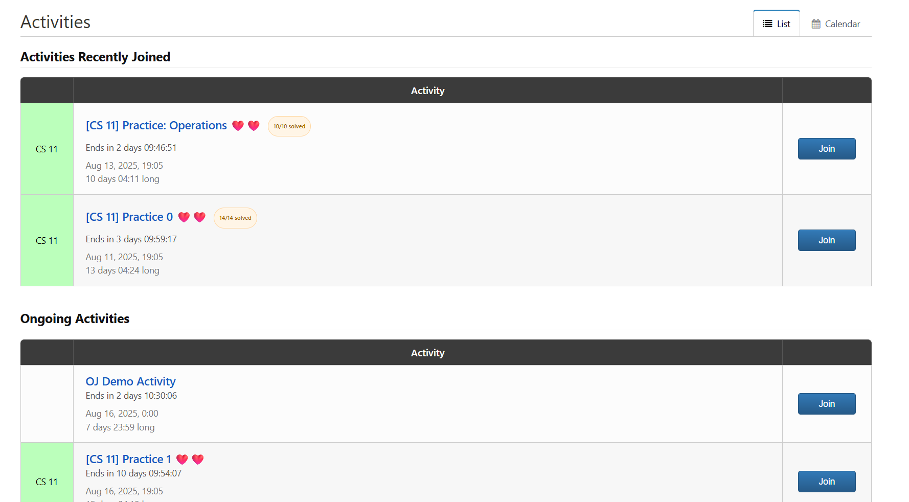
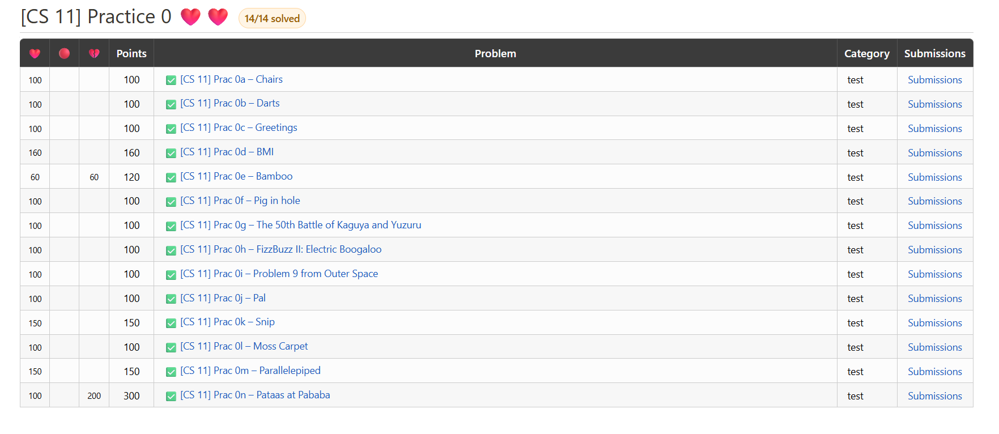

# Citrus Status (Chrome Extension)

Adds emoji status indicators and activity-level solved fractions to the UPD Online Judge at https://oj.dcs.upd.edu.ph/.

## Features
- ✅ Emoji before problems based on verdict (✅/❌/⚠️/👀)
- 🟠 Activity-level progress fraction (e.g., 9/10)
- 💾 Local storage of statuses (no server)

## Sample Screenshots

## License
GNU GENERAL PUBLIC LICENSE Version 3